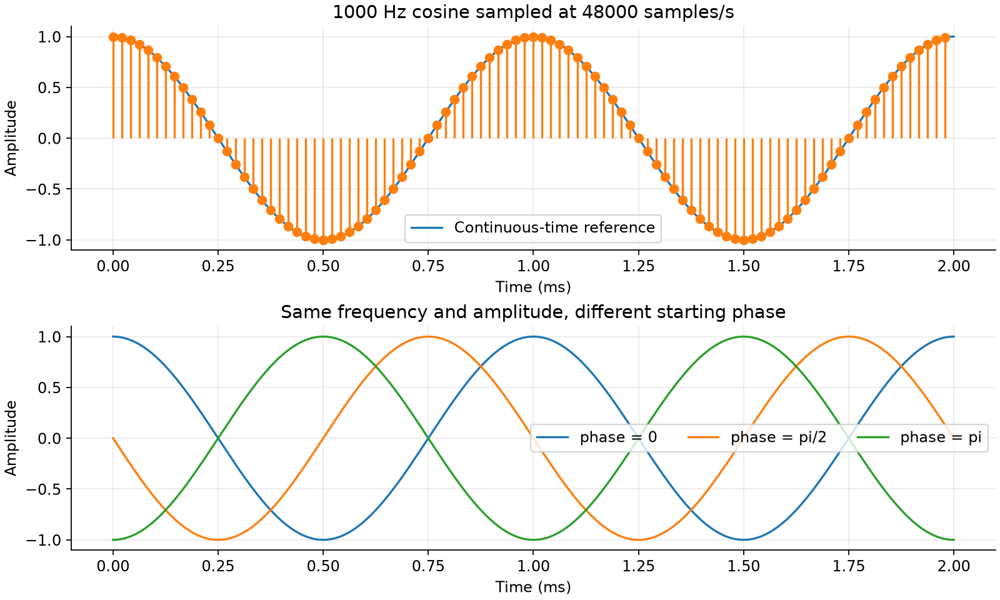
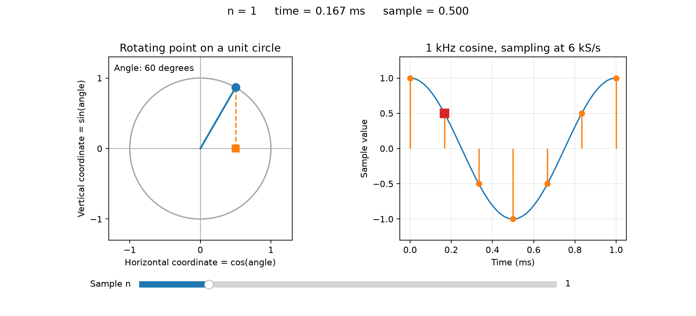
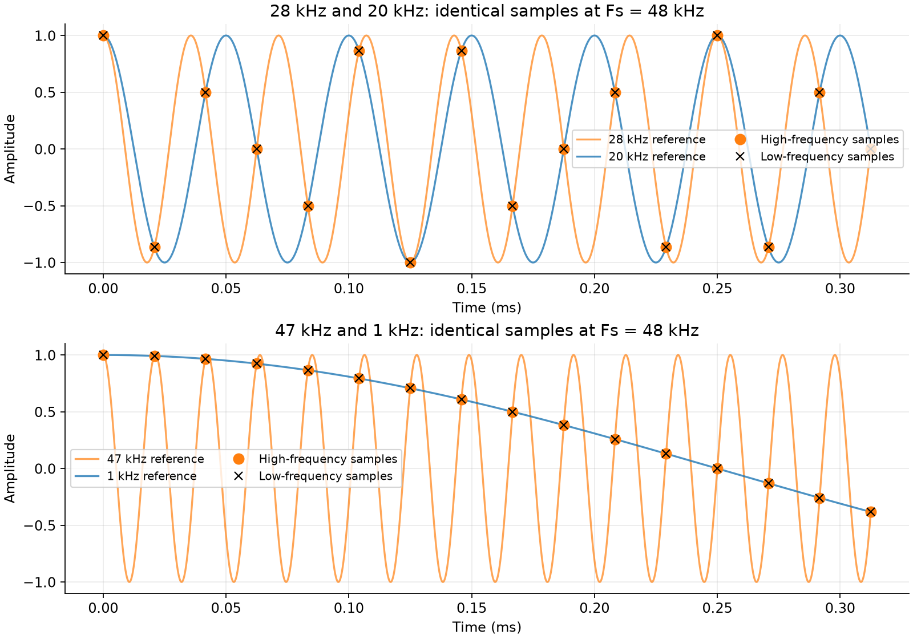

# 01. Синусоида → sampling → phase → aliasing

[К разделу](README.md) · [К карте курса](../../README.md)

Цель первого занятия — понять, что именно хранится в массиве цифрового сигнала. Нам понадобятся только NumPy и Matplotlib. Фильтры, FFT и разрядность пока подождут.

## 1. Сигнал до компьютера

Представь напряжение, которое плавно поднимается и опускается. Простейшая модель такого колебания:

$$
x(t)=A\cos(2\pi f t+\phi).
$$

| Обозначение | Смысл | Единицы |
|---|---|---|
| t | Время | s |
| A | Пиковая амплитуда | Здесь нормированная, без единиц |
| f | Число полных колебаний за секунду | Hz |
| φ | Начальная фаза — с какого места цикла начинаем | rad |

Почему внутри cos стоит 2π? Один полный оборот — 2π радиан. Частота f говорит, сколько оборотов происходит за секунду; f·t — сколько оборотов прошло; 2πf·t — соответствующий угол. Величина ω = 2πf называется angular frequency и измеряется в rad/s.

Косинус — тоже синусоидальное колебание: sin и cos отличаются лишь начальной фазой. При φ = 0 косинус начинается с максимума x(0) = A. При φ = π/2 он начинается с нуля и сначала убывает. При φ = π — с −A. Изменение начальной фазы не меняет число колебаний за секунду.

**Пример:** f = 1000 Hz означает 1000 циклов в секунду. Период T = 1/f = 0.001 s = 1 ms. При A = 1 сигнал меняется от −1 до +1; размах peak-to-peak равен 2.

Перед следующим шагом предскажи: что изменится на графике, если увеличить f вдвое? А если увеличить A вдвое?

## 2. Что сохраняет компьютер

Компьютер не хранит значение сигнала в каждый возможный момент. Мы берём значения через равные промежутки времени:

$$
T_s=1/F_s,\qquad t_n=n/F_s,\qquad
x[n]=A\cos(2\pi f n/F_s+\phi).
$$

Fs — sample rate в samples/s; n — целочисленный индекс 0, 1, 2, …; x[n] — один sample, то есть число. Буква f описывает колебание, а Fs — частоту наблюдений за ним. Это разные величины.

При Fs = 48 000 samples/s получаем Ts ≈ 20.833 μs. Для сигнала 1000 Hz на период приходится Fs/f = 48 samples. Эта величина не обязана быть целой для произвольного сигнала.

Частота f/Fs = 1/48 измеряется в cycles/sample, а 2πf/Fs — в rad/sample. Так физическая частота превращается в шаг фазы между соседними samples.

```python
import numpy as np
import matplotlib.pyplot as plt

fs = 48_000
f = 1_000
n = np.arange(96)          # индексы 0 ... 95
t = n / fs                # время каждого sample в секундах
x = np.cos(2 * np.pi * f * t)

plt.stem(t * 1000, x)
plt.xlabel('Time (ms)')
plt.ylabel('Amplitude')
plt.show()
```

Это уже цифровой сигнал. Первые значения примерно `[1, 0.991445, 0.965926, 0.923880, ...]`. Мы вычислили их непосредственно по формуле, моделируя идеальное sampling. Квантование реального ADC рассмотрим отдельно.

В массиве 96 samples: интервал записи N/Fs = 2 ms, но последний sample расположен в (N−1)/Fs ≈ 1.979 ms. Правая граница 2 ms не включена. Поэтому для временной оси используем `np.arange(N) / fs`.



На верхнем графике гладкая линия — опорная модель на частой сетке, а точки — наши реальные 96 samples. Соединяющая точки линия сама по себе не является доказательством восстановления исходного сигнала. На нижнем графике меняется только начальная фаза.

## 3. Как запустить и что менять

Полный [эксперимент](../../labs/01/01-sine-sampling.py) сохраняет два рисунка и численный отчёт. [Инструкция запуска](../../labs/01/README.md) описывает окружение.

В начале script есть параметры `FS`, `FREQUENCY`, `AMPLITUDE`, `PHASE`, `N`. Для первых опытов оставь `FS = 48_000`, чтобы следующий aliasing-эксперимент использовал те же условия.

1. Запусти исходный вариант: f = 1000 Hz, A = 1, φ = 0, N = 96.
2. Установи `FREQUENCY = 2_000`: сначала предскажи число циклов за 2 ms, затем проверь.
3. Верни 1000 Hz и поставь `AMPLITUDE = 0.5`: какие величины изменились?
4. Поставь `PHASE = np.pi / 2`: чему равно первое значение? В вычислениях вместо точного нуля возможен остаток порядка 10⁻¹⁶.
5. Верни исходные настройки. Перейди к следующему опыту.

Нижняя панель первого рисунка всегда сравнивает три фиксированные фазы. Второй рисунок — отдельный опыт с фиксированными частотами и нулевой фазой.

## Окружность, косинус и sampling

Окружность — геометрическая модель синусоиды. Точка движется по окружности радиуса 1; её горизонтальная координата равна cos(θ). Справа координата +1, сверху 0, слева −1, снизу 0. Если вращение равномерное, эта координата меняется со временем по закону косинуса. В проводе при этом ничего не обязано вращаться: моделируем изменение напряжения.

Частота f — число оборотов в секунду в этой модели. Sampling с частотой Fs означает, что Fs раз в секунду записываем горизонтальную координату. Между записями угол увеличивается на 360°·f/Fs.

Для наглядности возьмём f = 1 kHz и Fs = 6 kS/s. На один оборот приходится шесть интервалов sampling, шаг угла — 60°. Получаем значения 1, 0.5, −0.5, −1, −0.5, 0.5; следующий отсчёт начинает новый цикл с 1.



[Дополнительный Python-эксперимент](../../labs/01/circle-sampling.py) содержит ползунок номера отсчёта. Запуск из корня проекта:

```sh
uv run labs/01/circle-sampling.py --show
```

Теперь вернёмся к Fs = 48 kS/s. Для 1 kHz шаг угла равен 7.5°, для 47 kHz — 352.5°. Вторая точка каждый раз почти завершает оборот и оказывается там же, где оказалась бы при шаге −7.5°. Две точки расположены зеркально относительно горизонтальной оси: высота разная, горизонтальная координата одинаковая. Именно эту координату мы записываем, поэтому samples косинусов совпадают.

## 4. Неожиданность: одинаковые samples у разных сигналов

При Fs = 48 kHz сравним косинусы 20 и 28 kHz. Между точками они ведут себя по-разному, но в моменты sampling значения совпадают:

$$
\cos\left(2\pi\frac{28000}{48000}n\right)
=\cos\left(2\pi n-2\pi\frac{20000}{48000}n\right)
=\cos\left(2\pi\frac{20000}{48000}n\right).
$$

Здесь использованы два свойства: n — целое, поэтому 2πn не меняет косинус; cos(−θ) = cos(θ). Аналогично 47 kHz и 1 kHz дают одинаковые samples. Для этой пары при Fs = 48 kHz это можно проверить прямо в массиве:

```python
x_high = np.cos(2 * np.pi * 47_000 * t)
x_low = np.cos(2 * np.pi * 1_000 * t)
print(np.max(np.abs(x_high - x_low)))  # около нуля; остаётся ошибка float64
```



Оранжевые кружки и чёрные крестики совпадают. По одному массиву невозможно понять, какой из двух исходных сигналов его породил. Это aliasing — частотная неоднозначность после sampling.

Мы сравниваем косинусы с нулевой начальной фазой. В общем случае отражение f → Fs−f сопровождается изменением знака фазы у эквивалентного низкочастотного косинуса; не нужно переносить вывод «полностью одинаковые samples» на любые начальные фазы.

Чтобы однозначно представлять произвольный real baseband-сигнал с верхней частотой B, требуется Fs > 2B при соответствующем ограничении спектра до sampling. Fs/2 называют Nyquist frequency. Для Fs = 48 kHz это 24 kHz. Саму границу нельзя считать надёжной: синус на Fs/2 при нулевой фазе даст одни нули. Реальный anti-alias filter также требует transition band, поэтому закладывают запас.

Больше samples при неизменном Fs увеличивает длительность записи, но не устраняет эту неоднозначность. Позже увидим, как ограничить входную полосу до ADC и как выбирать Fs в приёмнике.

## 5. Самопроверка

- [ ] При f = 2 kHz и Fs = 48 kS/s могу найти период, шаг времени и число samples на период.
- [ ] Объясняю разницу между изменением f и изменением φ.
- [ ] Могу объяснить, почему 47 kHz выглядит как 1 kHz, не ссылаясь на FFT.
- [ ] Понимаю, почему увеличение длины массива не исправляет aliasing.

Задача для обсуждения: **Fs = 48 kS/s, f = 2 kHz, A = 0.5, φ = 0. Каков период, сколько samples приходится на один цикл и чему равен x[0]?** Сначала ответь без запуска кода, затем проверь.

## Что добавили в трансивер

У нас есть первый источник тестового сигнала и корректная временная ось. Такие тоны понадобятся для проверки mixer, фильтров и демодуляторов. Следующая тема — закрепить sampling на других частотах, затем отделить от него quantization. Для дальнейших тем возвращайся к [плану части 01](README.md).
